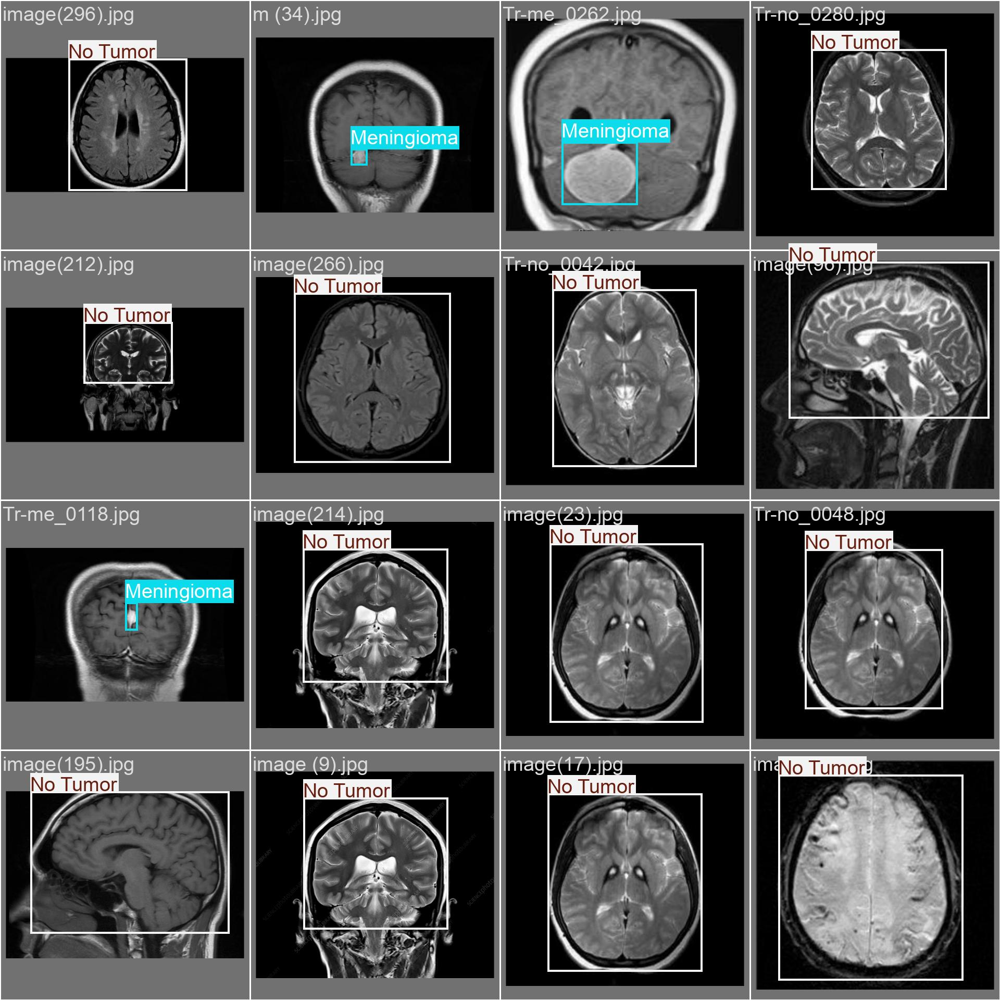

# 🧠 Brain Tumor Detection System (YOLO-based)

This project is an upgraded version of the Brain Tumor Detection System, now powered by the **YOLO object detection model** for improved performance and real-time tumor localization from MRI images. The new system offers an intuitive Streamlit-based web interface that allows users to upload brain MRI scans and receive instant tumor detection results.

## 🚀 Project Overview

Brain tumors can be life-threatening if not diagnosed early. This application aims to assist radiologists and medical practitioners by automating the detection of brain tumors from MRI scans using the **YOLOv8 model**. The web application highlights tumor regions and provides classification feedback with detection accuracy.

## 🎯 Key Features

- ✅ Upload MRI brain images (`.jpg`, `.jpeg`, `.png`)
- ✅ Real-time object detection using a fine-tuned YOLOv8 model
- ✅ Visual feedback with bounding boxes and class confidence
- ✅ Clean and modern Streamlit web interface
- ✅ Instant classification: "No Tumor", "Glioma", "Meningioma", or "Pituitary Tumor"
- 

## 🧠 Technologies Used

- Python
- [YOLOv8](https://github.com/ultralytics/ultralytics) (via `ultralytics` package)
- Streamlit
- OpenCV
- PIL (Python Imaging Library)
- Tempfile and OS modules for secure file handling

## 🖥️ Interface Preview

Upon uploading an image and clicking **"Click For Result"**, the application displays:
- The original image
- The annotated image with tumor detection (if present)
- A styled result box indicating tumor type and detection accuracy
## Loss Function Graph

Below is the loss function graph obtained during the training of our model:

## Example Output:
- Detected: Glioma with accuracy: 98.56%

- No tumor detected in the uploaded MRI image.

## Model Result in Web Interface Screenshots

Here are some snapshots of our web application interface:

## Challenges

- **Data Preprocessing**: Ensuring the MRI images were of a consistent format and quality for training posed initial challenges.
- **Overfitting**: Given the complexity of the model and the diverse dataset, avoiding overfitting required careful tuning of the model parameters.

## Future Work

- Implementing additional layers or alternative architectures (like ResNet or Inception) to improve accuracy.
- Expanding the dataset with more diverse examples to further enhance the model's robustness.
- Developing a mobile application to make the system more accessible.

## Model Training

The CNN model was trained using a comprehensive notebook on Kaggle, which outlines the entire process, including data preprocessing, model architecture setup, training, and evaluation. You can access the notebook and delve into the specifics of the training process here:

[Kaggle Notebook for Brain Tumor Detection System Training](https://www.kaggle.com/code/mahendranb7/brain-tumour-classification?rvi=1)

